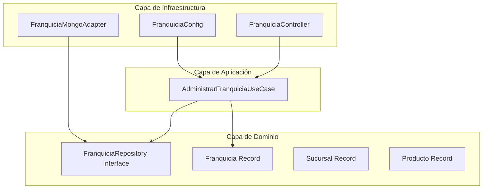

# API Reactiva para la Gestión de Franquicias

[](https://jdk.java.net/21/)
[](https://spring.io/projects/spring-boot)
[](https://mongodb.com/)
[](https://www.docker.com/)
[](https://www.gnu.org/software/make/)

Este proyecto hace parte de la **Prueba Técnica de Accenture** y consiste en una API REST reactiva desarrollada con **Spring Boot**, **Java 21** y **MongoDB**, diseñada bajo los principios de la **Arquitectura Hexagonal (Clean Architecture)**. Esta arquitectura asegura el desacoplamiento total entre las reglas de negocio y los detalles de infraestructura como la persistencia, el transporte o la configuración del framework.

---

## Tabla de Contenidos

- [Metodología de Cocreación con IA](#metodología-de-cocreación-con-ia)
- [Características Técnicas](#características-técnicas)
- [Estructura de la Arquitectura Hexagonal](#estructura-de-la-arquitectura-hexagonal)
- [Modelo de Datos en MongoDB](#modelo-de-datos-en-mongodb)
- [Requerimientos Funcionales Implementados](#requerimientos-funcionales-implementados)
- [Prerrequisitos e Instalación del Ambiente de Desarrollo](#prerrequisitos-e-instalación-del-ambiente-de-desarrollo)
- [Despliegue con Docker Compose](#despliegue-con-docker-compose)
- [Comandos del Makefile (GNU Make)](#comandos-del-makefile-gnu-make)
- [Pruebas Unitarias Reactivas](#pruebas-unitarias-reactivas)
- [Catálogo Detallado de Endpoints](#catálogo-detallado-de-endpoints)
- [Validaciones del Servidor](#validaciones-del-servidor)

---

## Metodología de Cocreación con IA

El desarrollo de esta solución integró Inteligencia Artificial como copiloto bajo el siguiente esquema:

* **Diseño y Parámetros:** Como arquitecto principal, definí el diseño conceptual, las reglas de negocio y los parámetros de construcción.
* **Automatización Estructural:** Uso de scripts (.sh) y automatización para la creación rápida de archivos y el boilerplate inicial.
* **Documentación:** Apoyo de la IA únicamente en la redacción del README (la estructuración de las secciones y su validación se realizaron manualmente).
* **Auditoría y Validación:** Todo el código generado fue auditado, corregido y validado de manera manual para asegurar la calidad y cumplimiento de las reglas de negocio.

---

## 🛠️ Características Técnicas

*   **Lenguaje:** Java 21 (aprovechando Records para la inmutabilidad de los modelos de dominio).
*   **Framework Core:** Spring Boot 3.3.2 (Spring WebFlux Reactivo).
*   **Persistencia:** Spring Data Reactive MongoDB.
*   **Servidor Embebido:** Netty (asíncrono y no bloqueante por defecto).
*   **Arquitectura:** Hexagonal estricta (Dominio $\rightarrow$ Aplicación $\leftarrow$ Infraestructura).
*   **Automatización de Tareas:** GNU Make (Makefile).
*   **Contenedores:** Docker y Docker Compose para un despliegue aislado y reproducible.

---

## 📐 Estructura de la Arquitectura Hexagonal

El proyecto sigue de forma estricta la regla de dependencia: **las capas externas dependen de las internas, pero el núcleo de dominio no tiene dependencias externas**.




### Descripción de Paquetes

*   **`domain.model`**: Contiene los objetos de negocio puros e inmutables. Se modelan mediante **Records de Java 21** (`Franquicia`, `Sucursal`, `Producto`), garantizando inmutabilidad por defecto y reduciendo el código boilerplate.
*   **`domain.repository`**: Define los puertos de salida (interfaces). Representa el contrato que la capa de dominio necesita para persistir los datos, aislando al dominio de saber si se almacena en MongoDB, SQL, o en memoria.
*   **`application.usecase`**: Contiene la lógica del negocio pura orquestada mediante programación funcional reactiva utilizando flujos de datos asíncronos (`Mono` y `Flux`).
*   **`infrastructure.entrypoints`**: Controladores REST reactivos expuestos. Reciben el tráfico HTTP, aplican validaciones de datos con **Jakarta Bean Validation** (`@Valid`, `@NotBlank`, `@Min`) y mapean los datos desde/hacia la capa de dominio.
*   **`infrastructure.adapters`**: Adaptadores que implementan los puertos de dominio. Contiene el repositorio reactivo de Spring Data MongoDB (`MongoFranquiciaRepository`), la entidad reactiva (`FranquiciaDocument`) y el adaptador principal (`FranquiciaMongoAdapter`) que traduce los datos entre el dominio y el driver de persistencia.
*   **`infrastructure.config`**: "Pegamento" del framework. Declara manualmente los Beans de la capa de aplicación (`AdministrarFranquiciaUseCase`) para evitar contaminar el dominio y los casos de uso con anotaciones específicas de Spring (como `@Service` o `@Autowired`).

### Estructura de Directorios (`src/`)

```text
src/
├── main/
│   ├── java/
│   │   └── com/
│   │       └── accenture/
│   │           └── franquicias/
│   │               ├── domain/
│   │               │   ├── model/
│   │               │   │   ├── Franquicia.java
│   │               │   │   ├── Sucursal.java
│   │               │   │   └── Producto.java
│   │               │   └── repository/
│   │               │       └── FranquiciaRepository.java
│   │               ├── application/
│   │               │   └── usecase/
│   │               │       └── AdministrarFranquiciaUseCase.java
│   │               ├── infrastructure/
│   │               │   ├── entrypoints/
│   │               │   │   ├── dto/
│   │               │   │   │   ├── ActualizarNombreRequest.java
│   │               │   │   │   ├── FranquiciaDTO.java
│   │               │   │   │   ├── ModificarStockRequest.java
│   │               │   │   │   ├── ProductoDTO.java
│   │               │   │   │   ├── ProductoMayorStockResponse.java
│   │               │   │   │   └── SucursalDTO.java
│   │               │   │   └── FranquiciaController.java
│   │               │   ├── adapters/
│   │               │   │   ├── entity/
│   │               │   │   │   └── FranquiciaDocument.java
│   │               │   │   ├── repository/
│   │               │   │   │   └── MongoFranquiciaRepository.java
│   │               │   │   └── FranquiciaMongoAdapter.java
│   │               │   └── config/
│   │               │       └── FranquiciaConfig.java
│   │               └── FranquiciasApplication.java
│   └── resources/
│       └── application.yml
└── test/
    └── java/
        └── com/
            └── accenture/
                └── franquicias/
                    └── application/
                        └── usecase/
                            └── AdministrarFranquiciaUseCaseTest.java
```

---

## 🗄️ Modelo de Datos en MongoDB

La solución adopta un enfoque **desnormalizado (documentos embebidos)**, el cual es el patrón recomendado en bases de datos NoSQL como MongoDB para relaciones de contención fuertes (*Franquicia contiene Sucursales, y cada Sucursal contiene Productos*).

### Estructura del Documento (`franquicias`)

Los datos se almacenan en una única colección llamada `franquicias`. A continuación se muestra un ejemplo del esquema JSON de un documento:

```json
{
  "_id": "1d8df5cc-ccbc-4e0f-bb7e-fcf61036814b",
  "nombre": "Franquicia de Hamburguesas Gourmet",
  "sucursales": [
    {
      "id": "f5b871c8-2b81-4cd4-883a-dcdff4f215bf",
      "nombre": "Sucursal Norte",
      "productos": [
        {
          "id": "a90df5cc-ddbb-49e0-811c-2ff567e98a1a",
          "nombre": "Mega Doble Queso Burger",
          "stock": 210
        }
      ]
    }
  ]
}
```


---

## 🚀 Requerimientos Funcionales Implementados

1.  **Agregar una nueva franquicia.**
2.  **Listar todas las franquicias** registradas de manera reactiva.
3.  **Agregar una sucursal** a una franquicia específica.
4.  **Agregar un producto** a una sucursal específica.
5.  **Eliminar un producto** de una sucursal.
6.  **Modificar el stock** de un producto específico.
7.  **Consultar el producto con mayor stock por cada sucursal** para una franquicia en específico, resolviendo la reducción de datos reactiva y funcional en memoria a través de flujos no bloqueantes.
8.  **Actualizar el nombre** de una franquicia.
9.  **Actualizar el nombre** de una sucursal.
10. **Actualizar el nombre** de un producto.

---

## Prerrequisitos e Instalación del Ambiente de Desarrollo

Para compilar, ejecutar y desplegar este proyecto, es necesario cumplir con ciertos prerrequisitos en su sistema operativo.

### Requisitos Generales
* **Docker y Docker Compose V2:** Necesarios para ejecutar la aplicación contenerizada (base de datos + API).
* **Java 21 JDK y Apache Maven 3.9+:** Requeridos para compilar y ejecutar el proyecto de forma local.
* **GNU Make:** Herramienta opcional pero recomendada para utilizar el Makefile de automatización.

---

### Instalación de Dependencias y Preparación del Ambiente

Al tratarse de un proyecto gestionado con Apache Maven, las librerías y dependencias reactivas (Spring WebFlux, Validation y Driver Reactivo de MongoDB) se descargan e instalan de forma automática al compilar el proyecto.

#### En Linux (Distribuciones basadas en RPM como Fedora o Red Hat)

1. Actualizar los repositorios del sistema:
   ```bash
   sudo dnf update
   ```

2. Instalar el Kit de Desarrollo de Java 21 (OpenJDK 21):
   ```bash
   sudo dnf install java-21-openjdk-devel
   ```

3. Instalar Apache Maven:
   ```bash
   sudo dnf install maven
   ```

4. Instalar herramientas de automatización (herramienta Make):
   ```bash
   sudo dnf install make
   ```

5. Descargar e instalar las librerías del proyecto:
   Ejecute el comando de compilación en la raíz del directorio para que Maven descargue de forma asíncrona todas las dependencias declaradas en el archivo `pom.xml`:
   ```bash
   make compile
   ```

#### En Windows

1. **Instalar Java 21:**
   * Descargue el instalador MSI de OpenJDK 21 o Eclipse Temurin 21.
   * Ejecute el instalador y asegúrese de marcar la opción **"Add to PATH"** (Agregar a las variables de entorno) antes de finalizar.

2. **Instalar Apache Maven:**
   * Descargue el archivo binario comprimido (.zip) desde el sitio web oficial de Apache Maven.
   * Extraiga el contenido en una ruta local fija (por ejemplo, `C:\Program Files\maven`).
   * Agregue la ruta de la carpeta bin (ej. `C:\Program Files\maven\bin`) a las Variables de Entorno del Sistema dentro de la variable `Path`.

3. **Verificar las instalaciones en la consola (PowerShell o CMD):**
   ```powershell
   java -version
   mvn -version
   ```

4. **Descargar e instalar las librerías del proyecto:**
   Navegue con la consola hasta la carpeta raíz donde se encuentra el archivo `pom.xml` y ejecute el comando nativo de Maven para sincronizar y descargar los componentes reactivos:
   ```powershell
   mvn clean compile
   ```

---

## 🐳 Despliegue con Docker Compose

El proyecto está configurado para ejecutarse en contenedores Docker mediante Compose de forma flexible, adaptándose a tu flujo de desarrollo:

### Opción A: Desplegar todo el ecosistema (MongoDB + API)
Ideal para probar el despliegue completo de la aplicación tal como funcionaría en producción:
```bash
make docker-up
```
*Este comando compila el proyecto Maven, construye la imagen Docker de la API localmente y arranca tanto el contenedor de la base de datos (`mongodb`) como el de la aplicación (`app`) en segundo plano.*

### Opción B: Iniciar solo la base de datos (MongoDB)
Ideal si deseas ejecutar la API de forma local desde tu máquina (usando tu IDE favorito o con `make run` en la terminal) pero necesitas la base de datos activa:
```bash
make docker-db
```
*Este comando levanta únicamente el contenedor de `mongodb` en segundo plano, dejando libres los puertos locales para que puedas depurar la API directamente.*

### Detener y limpiar recursos:
Independientemente de la opción elegida, para detener los contenedores y remover las redes virtuales creadas ejecuta:
```bash
make docker-down
```

### Puertos de Red Asignados

| Servicio | Entorno | Host Local | Puerto Interno (Contenedor) |
| :--- | :--- | :--- | :--- |
| **API Reactiva (App)** | Despliegue Completo Docker | [http://localhost:8090](http://localhost:8090) | `8080` |
| **API Reactiva (App)** | Ejecución Local (`make run` / IDE) | [http://localhost:8080](http://localhost:8080) | `8080` |
| **MongoDB** | Base de datos persistente | `localhost:27017` | `27017` |

---

## ⚙️ Comandos del Makefile (GNU Make)

El proyecto incluye un `Makefile` en la raíz para simplificar la ejecución de las tareas comunes:

*   `make compile`: Limpia el proyecto y compila el código fuente (`mvn clean compile`).
*   `make run`: Corre la aplicación de manera local interactiva expuesta en el puerto `8080` (`mvn spring-boot:run`).
*   `make build-jar`: Genera el empaquetado de producción omitiendo las pruebas unitarias (`mvn clean package -DskipTests`).
*   `make run-jar`: Ejecuta directamente el JAR empaquetado en el directorio target.
*   `make docker-up`: Construye e inicia la aplicación completa y la base de datos en segundo plano (`docker compose up -d`).
*   `make docker-db`: Inicia únicamente el contenedor de la base de datos MongoDB (`docker compose up -d mongodb`).
*   `make docker-down`: Detiene y remueve los contenedores y redes asociadas (`docker compose down`).
*   `make clean`: Limpia los artefactos generados por Maven y compilaciones pasadas (`mvn clean`).

---

## 🧪 Pruebas Unitarias Reactivas

Las pruebas unitarias del proyecto garantizan el correcto comportamiento del flujo reactivo, asegurando que no existan bloqueos de hilos durante la ejecución.
*   **Mockito**: Utilizado para aislar la capa de persistencia simulando las respuestas de los puertos (`FranquiciaRepository`).
*   **StepVerifier (Project Reactor)**: Utilizado para verificar de manera cronológica y asíncrona la emisión de elementos en los flujos `Mono` y `Flux` y validar el éxito o los errores esperados.

Para correr toda la suite de pruebas unitarias, ejecuta:
```bash
mvn test
```

---

## 📖 Catálogo Detallado de Endpoints

> [!NOTE]
> Todos los ejemplos a continuación asumen la ejecución bajo el puerto de Docker **`8090`**. Si estás corriendo la aplicación localmente sin Docker usando `make run`, reemplaza el puerto por el **`8080`**.

### 1. Franquicias

#### 🔹 Obtener todas las franquicias
*   **Método:** `GET`
*   **URL:** `/api/franquicias`
*   **Código de Respuesta:** `200 OK`
*   **Ejemplo de Respuesta:**
    ```json
    [
      {
        "id": "1d8df5cc-ccbc-4e0f-bb7e-fcf61036814b",
        "nombre": "Franquicia de Hamburguesas Gourmet",
        "sucursales": [
          {
            "id": "f5b871c8-2b81-4cd4-883a-dcdff4f215bf",
            "nombre": "Sucursal Norte",
            "productos": [
              {
                "id": "a90df5cc-ddbb-49e0-811c-2ff567e98a1a",
                "nombre": "Doble Queso Burger",
                "stock": 150
              }
            ]
          }
        ]
      }
    ]
    ```

#### 🔹 Crear una nueva franquicia
*   **Método:** `POST`
*   **URL:** `/api/franquicias`
*   **Código de Respuesta:** `201 Created`
*   **Cuerpo de la Petición (Request):**
    ```json
    {
      "nombre": "Franquicia Hamburguesas Gourmet"
    }
    ```
*   **Ejemplo de Respuesta:**
    ```json
    {
      "id": "1d8df5cc-ccbc-4e0f-bb7e-fcf61036814b",
      "nombre": "Franquicia Hamburguesas Gourmet",
      "sucursales": []
    }
    ```

#### 🔹 Modificar nombre de la franquicia
*   **Método:** `PUT`
*   **URL:** `/api/franquicias/{franquiciaId}/nombre`
*   **Código de Respuesta:** `200 OK`
*   **Cuerpo de la Petición (Request):**
    ```json
    {
      "nuevoNombre": "Franquicia Hamburguesas Gourmet Premium"
    }
    ```

---

### 2. Sucursales

#### 🔹 Agregar sucursal a una franquicia
*   **Método:** `POST`
*   **URL:** `/api/franquicias/{franquiciaId}/sucursales`
*   **Código de Respuesta:** `201 Created`
*   **Cuerpo de la Petición (Request):**
    ```json
    {
      "nombre": "Sucursal Norte"
    }
    ```
*   **Ejemplo de Respuesta:**
    ```json
    {
      "id": "1d8df5cc-ccbc-4e0f-bb7e-fcf61036814b",
      "nombre": "Franquicia Hamburguesas Gourmet Premium",
      "sucursales": [
        {
          "id": "f5b871c8-2b81-4cd4-883a-dcdff4f215bf",
          "nombre": "Sucursal Norte",
          "productos": []
        }
      ]
    }
    ```

#### 🔹 Modificar nombre de una sucursal
*   **Método:** `PUT`
*   **URL:** `/api/franquicias/{franquiciaId}/sucursales/{sucursalId}/nombre`
*   **Código de Respuesta:** `200 OK`
*   **Cuerpo de la Petición (Request):**
    ```json
    {
      "nuevoNombre": "Sucursal Norte Renovada"
    }
    ```

---

### 3. Productos y Lógica de Stock

#### 🔹 Agregar producto a una sucursal
*   **Método:** `POST`
*   **URL:** `/api/franquicias/{franquiciaId}/sucursales/{sucursalId}/productos`
*   **Código de Respuesta:** `201 Created`
*   **Cuerpo de la Petición (Request):**
    ```json
    {
      "nombre": "Doble Queso Burger",
      "stock": 150
    }
    ```

#### 🔹 Eliminar producto de una sucursal
*   **Método:** `DELETE`
*   **URL:** `/api/franquicias/{franquiciaId}/sucursales/{sucursalId}/productos/{productoId}`
*   **Código de Respuesta:** `200 OK`
*   **Ejemplo de Respuesta:** Retorna la franquicia actualizada sin el producto en su lista interna.

#### 🔹 Modificar el stock de un producto específico
*   **Método:** `PUT`
*   **URL:** `/api/franquicias/{franquiciaId}/sucursales/{sucursalId}/productos/{productoId}/stock`
*   **Código de Respuesta:** `200 OK`
*   **Cuerpo de la Petición (Request):**
    ```json
    {
      "nuevoStock": 210
    }
    ```

#### 🔹 Modificar nombre de un producto específico
*   **Método:** `PUT`
*   **URL:** `/api/franquicias/{franquiciaId}/sucursales/{sucursalId}/productos/{productoId}/nombre`
*   **Código de Respuesta:** `200 OK`
*   **Cuerpo de la Petición (Request):**
    ```json
    {
      "nuevoNombre": "Mega Doble Queso Burger"
    }
    ```

#### 🔹 Consultar producto con mayor stock por cada sucursal
*   **Método:** `GET`
*   **URL:** `/api/franquicias/{franquiciaId}/max-stock-por-sucursal`
*   **Código de Respuesta:** `200 OK`
*   **Descripción:** Recupera la franquicia desde la base de datos reactiva, itera de manera reactiva y no bloqueante sobre sus sucursales, calcula en memoria (utilizando la operación `.reduce()` de Reactor) el producto que cuenta con la mayor cantidad de unidades en existencias dentro de cada una, y retorna la lista reducida.
*   **Ejemplo de Respuesta:**
    ```json
    [
      {
        "sucursalNombre": "Sucursal Norte Renovada",
        "productoNombre": "Mega Doble Queso Burger",
        "stock": 210
      },
      {
        "sucursalNombre": "Sucursal Sur",
        "productoNombre": "Papas Fritas Medianas",
        "stock": 450
      }
    ]
    ```

---

## 🛡️ Validaciones del Servidor

Todas las entradas de las peticiones REST son validadas en el Entrypoint utilizando anotaciones de Jakarta Validation. Si ocurre un fallo de validación, la API retornará un código `400 Bad Request` detallando las razones:
*   El nombre de la franquicia, sucursal o producto no puede estar vacío (`@NotBlank`).
*   Los valores de stock ingresados en la creación o actualización deben ser números mayores o iguales a cero (`@Min(value = 0)`).
*   Los payloads no pueden venir nulos en campos requeridos (`@NotNull`).
